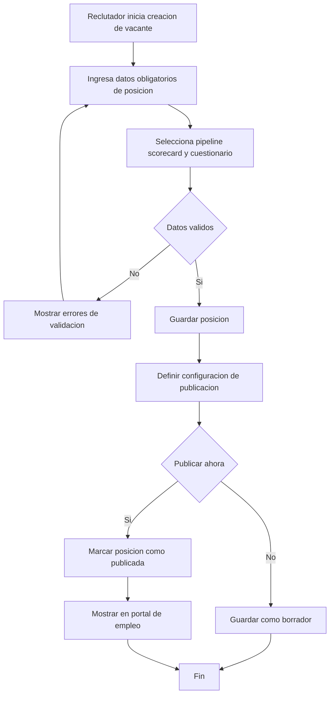
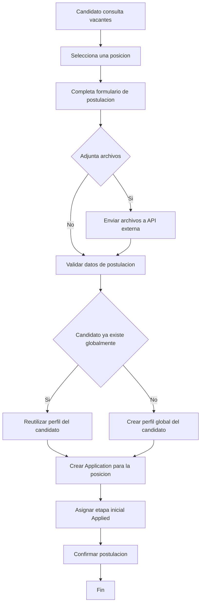
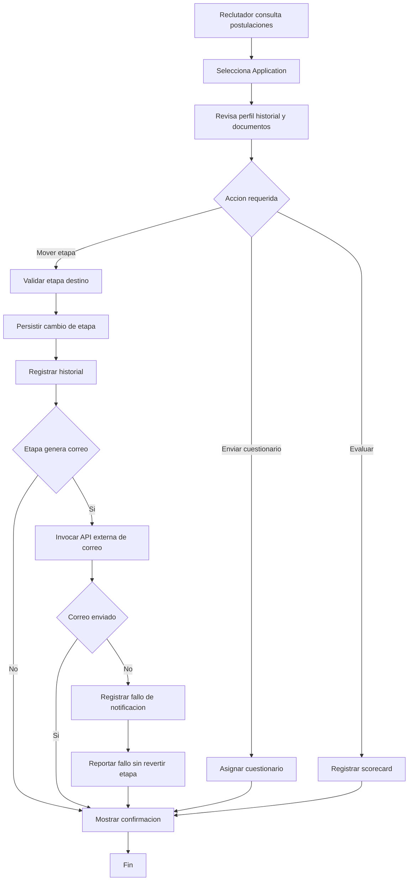
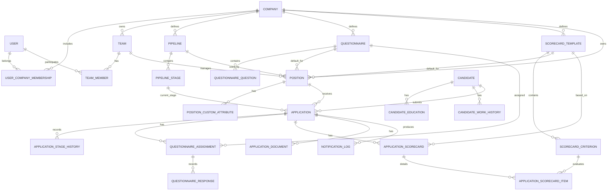
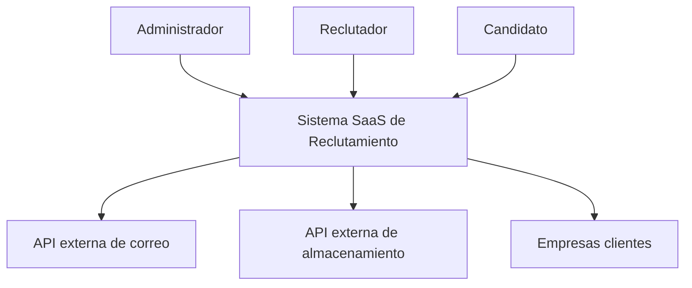
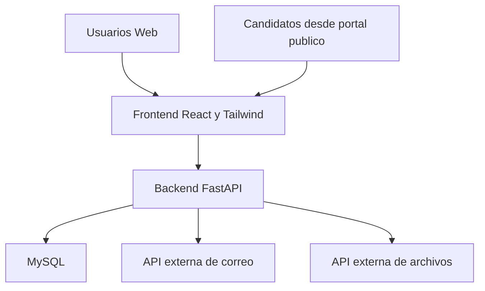
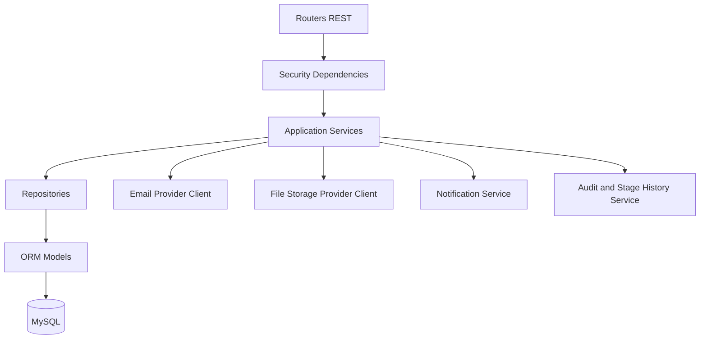

# Sistema SaaS de Reclutamiento y Portal de Empleos

## Documento Integral de Vision, Planificacion, Requerimientos y Diseno

### Portada de Entrega

**Institucion:** Universidad Mariano Gálvez de Guatemala  
**Facultad / Carrera:** Ingeniería en Sistemas de Información  
**Curso:** Ingeniería del Software  
**Docente:** Ing. Leonardo Cruz  
**Proyecto:** Plataforma SaaS de Reclutamiento y Portal de Empleos  
**Cliente del caso:** Recruitment Solutions  
**Equipo / Autor(es):** Roberto Castro 
**Version del documento:** 1.0  
**Fecha:** 2026-05-09  
**Estado:** Documento formal de analisis, planificacion y diseno  

---

## Control Documental

| Campo | Valor |
|---|---|
| Nombre del documento | Documento Integral de Vision, Planificacion, Requerimientos y Diseno |
| Proyecto | Plataforma SaaS de Reclutamiento y Portal de Empleos |
| Cliente | Recruitment Solutions |
| Version | 1.0 |
| Fecha | 2026-05-09 |
| Estado | Aprobado para refinamiento y entrega formal |
| Elaborado por | [Completar autor o equipo] |
| Revisado por | [Completar revisor] |
| Aprobado por | [Completar responsable] |

## Resumen Ejecutivo

El presente documento consolida el analisis y diseno de una plataforma SaaS orientada a la gestion de procesos de reclutamiento para multiples empresas. La solucion propuesta responde a la necesidad de centralizar la administracion de vacantes, candidatos, postulaciones, evaluaciones y comunicaciones dentro de un mismo ecosistema digital.

El producto contempla una aplicacion web administrativa y un portal publico de empleos. Sin embargo, para la primera etapa del proyecto el alcance de implementacion se concentra en el backend, el cual se desarrollara con FastAPI, base de datos MySQL, autenticacion JWT e integraciones externas para correo y almacenamiento de archivos.

Este documento integra vision del producto, planificacion, backlog, modelado de procesos BPMN, modelo de datos E-R, arquitectura C4 y propuesta de prototipos, dejando una base formal y coherente para la implementacion tecnica y la posterior elaboracion del entregable final en PDF.

## Metodologia de Elaboracion

La construccion del documento siguio un enfoque incremental, ordenando los entregables segun sus dependencias naturales:

1. Vision del producto para fijar problema, alcance, objetivos y restricciones.
2. Planificacion y backlog para traducir el problema en trabajo priorizado.
3. Modelado de procesos de negocio para representar el flujo operativo del reclutamiento.
4. Modelado de datos para asegurar coherencia entre reglas del negocio y persistencia.
5. Arquitectura C4 para representar la solucion tecnica en distintos niveles de abstraccion.
6. Mockups funcionales para conectar la solucion tecnica con la futura experiencia de usuario.

Esta secuencia permitio reducir ambiguedad, evitar contradicciones entre artefactos y consolidar una fuente unica de documentacion para entrega formal.

## Tabla de Contenido

1. Vision del Producto
2. Planificacion y Cronograma
3. Requerimientos y Product Backlog
4. Modelado de Procesos de Negocio BPMN
5. Diagrama de Datos Modelo E-R
6. Arquitectura del Sistema Modelo C4
7. Prototipo y Mockups de la Aplicacion
8. Conclusiones
9. Recomendaciones Finales

---

## 1. Vision del Producto

### 1.1 Informacion General

- Proyecto: Plataforma SaaS de Reclutamiento y Portal de Empleos
- Cliente: Recruitment Solutions
- Version: 1.0
- Fecha: 2026-05-09
- Estado: Base para entrega formal

### 1.2 Proposito del Documento

Este documento integral consolida la vision, planificacion, requerimientos y diseno del sistema solicitado por Recruitment Solutions. Su finalidad es servir como base formal para analisis, implementacion, evaluacion academica y preparacion del entregable final en formato PDF.

### 1.3 Descripcion del Problema

Recruitment Solutions requiere una plataforma web que permita a multiples empresas administrar sus procesos de reclutamiento bajo un modelo SaaS. En el estado actual del problema, los procesos de captacion, seguimiento, evaluacion y comunicacion con candidatos suelen operar de manera manual, dispersa o apoyada en herramientas no integradas, generando perdida de trazabilidad, baja colaboracion entre reclutadores y poca estandarizacion de etapas.

Adicionalmente, las empresas necesitan publicar vacantes, recibir postulaciones, evaluar candidatos mediante cuestionarios y scorecards, y comunicar avances del proceso a traves de correo electronico.

### 1.4 Oportunidad de Negocio

La solucion propuesta permitira a Recruitment Solutions ofrecer una plataforma reusable y escalable para distintas companias, monetizada mediante membresias. El sistema centralizara el proceso de reclutamiento, reducira tiempos operativos y abrira la posibilidad de evolucionar el producto hacia una solucion integral de gestion del talento.

### 1.5 Objetivos del Negocio

1. Comercializar una plataforma SaaS orientada a procesos de reclutamiento multiempresa.
2. Reducir tiempos operativos en la gestion de vacantes y candidatos.
3. Estandarizar pipelines de contratacion por empresa.
4. Mejorar la trazabilidad del proceso de seleccion.
5. Centralizar publicaciones, postulaciones, evaluaciones y comunicaciones.
6. Permitir crecimiento futuro del producto hacia una solucion integral de reclutamiento.

### 1.6 Objetivos del Sistema

1. Permitir que usuarios autenticados operen segun su rol y compania activa.
2. Soportar operacion multiempresa para un mismo usuario.
3. Gestionar posiciones vacantes con atributos configurables.
4. Registrar candidatos globales y multiples postulaciones por posicion.
5. Administrar pipelines y etapas por compania.
6. Asignar cuestionarios y scorecards durante el proceso.
7. Automatizar envios de correo por cambio de etapa mediante una API externa.
8. Permitir publicacion de vacantes en un portal de empleo.
9. Exponer una capa de APIs REST como entregable principal de la primera fase.

### 1.7 Stakeholders

1. Recruitment Solutions, como propietario del producto.
2. Empresas clientes, como usuarias de la plataforma.
3. Administradores de compania.
4. Reclutadores.
5. Aspirantes o candidatos.
6. Equipo de desarrollo.
7. Equipo academico o evaluador.

### 1.8 Usuarios y Necesidades

**Administrador**  
Necesita gestionar companias, usuarios, pipelines, cuestionarios, scorecards y configuraciones generales.

**Reclutador**  
Necesita crear y publicar posiciones, revisar candidatos, mover postulaciones entre etapas, adjuntar documentos y ejecutar acciones del proceso.

**Aspirante**  
Necesita consultar vacantes publicadas, completar formularios de postulacion y recibir comunicaciones del proceso.

### 1.9 Alcance del Producto

La solucion completa contempla una aplicacion web para administracion interna del reclutamiento y un portal publico de empleos. No obstante, en la primera etapa del proyecto se implementara unicamente el backend mediante APIs REST, dejando el frontend definido a nivel funcional, arquitectonico y de mockups.

#### 1.9.1 Alcance funcional incluido

1. Gestion de companias.
2. Gestion de usuarios y membresias multiempresa.
3. Gestion de equipos de reclutamiento.
4. Gestion de pipelines y etapas.
5. Gestion de cuestionarios.
6. Gestion de scorecards.
7. Creacion, consulta y actualizacion de posiciones.
8. Consulta y actualizacion de candidatos.
9. Registro de postulaciones por posicion.
10. Movimiento de candidatos a traves de etapas.
11. Envio sincronico de correos por API externa con reporte de fallo sin revertir el cambio principal.
12. Gestion de documentos a traves de un servicio externo con acceso protegido por Bearer token.
13. Publicacion de posiciones para portal de empleo.

#### 1.9.2 Alcance funcional no incluido en la primera fase

1. Implementacion completa del frontend React.
2. Exportacion avanzada de reportes gerenciales.
3. Integraciones con bolsas de empleo externas.
4. Automatizacion asincrona mediante colas o workers.
5. Analitica avanzada o inteligencia de reclutamiento.

### 1.10 Caracteristicas principales del producto

1. Plataforma SaaS multiempresa.
2. JWT para autenticacion.
3. Usuarios con acceso a multiples companias.
4. Candidatos globales con multiples postulaciones.
5. Pipelines configurables por compania.
6. Pipeline default: Applied, Feedback, Interviewing, Made Offer, Disqualified, Hired.
7. Posiciones con atributos estructurados y atributos personalizados seguros.
8. Cuestionarios y scorecards para evaluacion.
9. Correos via servicio externo.
10. Archivos via servicio externo.

### 1.11 Reglas del Negocio Relevantes

1. Un usuario puede operar en multiples companias.
2. La autorizacion debe validarse contra la compania activa.
3. El candidato existe globalmente en el sistema.
4. Un candidato puede aplicar a multiples posiciones.
5. El avance por etapas pertenece a la postulacion y no al candidato global.
6. Una posicion pertenece a una compania.
7. Cada posicion puede asociarse a un pipeline, scorecard y cuestionario por defecto.
8. Si falla el envio del correo durante un cambio de etapa, el cambio principal debe persistirse y reportarse el fallo.
9. Los archivos deben descargarse mediante autenticacion Bearer y no mediante URL publica.
10. Los atributos personalizados marcados como `secure` deben cifrarse en reposo.

### 1.12 Restricciones Tecnicas

1. Backend con FastAPI.
2. Frontend previsto con React y Tailwind.
3. Base de datos MySQL.
4. Autenticacion con JWT.
5. Integraciones de correo y archivos mediante APIs externas.
6. Entrega inicial centrada en backend.

### 1.13 Riesgos Iniciales

1. Dependencia operativa de APIs externas para correo y archivos.
2. Latencia adicional por envio sincronico de correo.
3. Riesgo de modelar incorrectamente candidato y postulacion si no se mantiene la separacion del dominio.
4. Riesgo de seguridad si no se implementa correctamente el cifrado de atributos seguros.
5. Riesgo de crecimiento del alcance si se intenta implementar frontend completo en esta fase.

---

## 2. Planificacion y Cronograma

### 2.1 Objetivo de la Planificacion

Definir una secuencia de trabajo realista para el analisis, diseno e implementacion inicial del sistema, priorizando la capa backend, la calidad del modelado del dominio y la produccion de los entregables documentales.

### 2.2 Estrategia de Trabajo

Se propone una planificacion iterativa por fases. Las primeras fases consolidan analisis y diseno; las siguientes se enfocan en implementacion del backend y preparacion del frontend para una etapa posterior.

### 2.3 Fases del Proyecto

| Fase | Nombre | Duracion estimada |
|---|---|---|
| F1 | Analisis y vision del producto | 1 semana |
| F2 | Requerimientos detallados y backlog | 1 semana |
| F3 | Diseno del negocio y arquitectura | 1 semana |
| F4 | Infraestructura base backend | 1 semana |
| F5 | Modulos core de reclutamiento | 2 semanas |
| F6 | Evaluacion e integraciones externas | 2 semanas |
| F7 | Validacion, documentacion final y cierre | 1 semana |

### 2.4 Actividades por Fase

#### F1 Analisis y vision del producto

1. Revisar requerimientos fuente.
2. Consolidar decisiones de negocio y tecnologia.
3. Elaborar documento de vision.
4. Definir alcance de la primera etapa.

#### F2 Requerimientos detallados y backlog

1. Identificar temas, epicas e historias.
2. Estimar historias de usuario.
3. Definir criterios de aceptacion.
4. Priorizar MVP.

#### F3 Diseno del negocio y arquitectura

1. Modelar procesos BPMN.
2. Construir modelo E-R.
3. Elaborar arquitectura C4.
4. Definir contratos API a alto nivel.

#### F4 Infraestructura base backend

1. Inicializar proyecto FastAPI.
2. Configurar MySQL y migraciones.
3. Configurar seguridad JWT.
4. Implementar manejo de errores y configuracion.

#### F5 Modulos core de reclutamiento

1. Companias y membresias.
2. Pipelines y etapas.
3. Posiciones.
4. Candidatos.
5. Postulaciones e historial de etapas.

#### F6 Evaluacion e integraciones externas

1. Cuestionarios y respuestas.
2. Scorecards.
3. Integracion de almacenamiento de archivos.
4. Integracion de correo sincronico.
5. Logs de notificacion.

#### F7 Validacion, documentacion final y cierre

1. Revisar cobertura funcional del backend.
2. Consolidar documentacion.
3. Preparar entregable formal.
4. Revisar riesgos abiertos y siguientes pasos.

### 2.5 Dependencias Clave

1. El backlog depende del documento de vision.
2. BPMN, E-R y C4 dependen de reglas del negocio y backlog ya consolidados.
3. La implementacion de postulaciones depende del modelado correcto entre `Candidate` y `Application`.
4. La integracion de correo depende de la definicion de eventos por etapa.
5. La integracion documental depende de la especificacion de autorizacion Bearer y politica de descarga.

### 2.6 Cronograma Tentativo

| Semana | Actividades principales | Entregables |
|---|---|---|
| 1 | Vision del producto y alcance | Documento de Vision |
| 2 | Historias, backlog, criterios, estimacion | Product Backlog |
| 3 | BPMN, E-R, C4, mockups | Diseno del negocio y arquitectura |
| 4 | Base FastAPI, MySQL, JWT | Infraestructura inicial |
| 5 | Companias, pipelines, posiciones | Modulos core I |
| 6 | Candidatos, postulaciones, etapas | Modulos core II |
| 7 | Cuestionarios, scorecards, archivos, correo | Integraciones y evaluacion |
| 8 | Validacion, ajustes y documento final | Entrega consolidada |

### 2.7 Hitos

1. H1 Documento de vision aprobado.
2. H2 Backlog y criterios de aceptacion aprobados.
3. H3 Diseno BPMN, E-R y C4 completado.
4. H4 Base tecnica del backend operativa.
5. H5 Gestion de posiciones y postulaciones funcional.
6. H6 Integraciones externas operativas.
7. H7 Documentacion final consolidada.

### 2.8 Riesgos de Planificacion y Mitigacion

**Riesgos**

1. Retrabajo por cambios de alcance.
2. Retrasos por dependencia de APIs externas.
3. Retrasos por ajustes al modelo de datos.
4. Riesgo de sobrecarga si se intenta implementar frontend completo en la misma etapa.

**Medidas de mitigacion**

1. Mantener backlog priorizado por MVP.
2. Disenar adaptadores desacoplados para servicios externos.
3. Validar pronto el modelo de dominio y el E-R.
4. Proteger el alcance de la primera fase enfocandolo en backend.

---

## 3. Requerimientos y Product Backlog

### 3.1 Enfoque de Priorizacion

El backlog se organiza por temas, epicas, historias de usuario y tareas tecnicas. La prioridad se clasifica en Alta, Media y Baja. La estimacion se expresa en Story Points utilizando una escala tipo Fibonacci: 1, 2, 3, 5, 8, 13.

### 3.2 Temas del Producto

1. Seguridad y acceso.
2. Gestion organizacional.
3. Configuracion del proceso de reclutamiento.
4. Gestion de posiciones vacantes.
5. Gestion de candidatos y postulaciones.
6. Evaluacion de candidatos.
7. Integraciones externas.
8. Portal de empleo.

### 3.3 Product Backlog

#### Tema 1. Seguridad y acceso

##### Epica 1.1 Autenticacion y contexto multiempresa

| ID | Historia de Usuario | Prioridad | SP |
|---|---|---|---|
| HU-01 | Como usuario quiero iniciar sesion con credenciales seguras para acceder al sistema segun mis permisos. | Alta | 5 |
| HU-02 | Como usuario quiero ver las companias a las que pertenezco para operar en el contexto correcto. | Alta | 3 |
| HU-03 | Como usuario quiero seleccionar mi compania activa para ejecutar acciones en el contexto adecuado. | Alta | 3 |
| HU-04 | Como administrador quiero que cada endpoint valide mi membresia a la compania activa para proteger la informacion. | Alta | 8 |

Tareas tecnicas asociadas:

1. Implementar emision y validacion de JWT.
2. Implementar refresh token.
3. Crear dependencia de FastAPI para compania activa.
4. Implementar control de acceso por rol y membresia.

#### Tema 2. Gestion organizacional

##### Epica 2.1 Gestion de companias y equipos

| ID | Historia de Usuario | Prioridad | SP |
|---|---|---|---|
| HU-05 | Como administrador quiero consultar la informacion de una compania para administrar su configuracion. | Alta | 2 |
| HU-06 | Como usuario quiero listar las companias disponibles para mi cuenta para cambiar de contexto facilmente. | Alta | 2 |
| HU-07 | Como administrador quiero agrupar reclutadores en equipos para distribuir procesos de seleccion. | Media | 5 |

Tareas tecnicas asociadas:

1. Modelar `companies`, `memberships`, `teams` y `team_members`.
2. Exponer endpoints de consulta de companias.
3. Exponer CRUD basico de equipos.

#### Tema 3. Configuracion del proceso de reclutamiento

##### Epica 3.1 Pipelines y etapas

| ID | Historia de Usuario | Prioridad | SP |
|---|---|---|---|
| HU-08 | Como administrador quiero definir pipelines para adaptar el proceso de seleccion de mi empresa. | Alta | 5 |
| HU-09 | Como reclutador quiero consultar las etapas de un pipeline para operar correctamente sobre una vacante. | Alta | 3 |
| HU-10 | Como sistema quiero disponer de un pipeline default con etapas base para inicializar nuevas posiciones. | Alta | 2 |

##### Epica 3.2 Cuestionarios y scorecards

| ID | Historia de Usuario | Prioridad | SP |
|---|---|---|---|
| HU-11 | Como administrador quiero crear cuestionarios predefinidos para evaluar candidatos. | Alta | 5 |
| HU-12 | Como administrador quiero configurar scorecards para estandarizar evaluaciones. | Alta | 5 |
| HU-13 | Como reclutador quiero asignar cuestionarios a candidatos durante el proceso de seleccion. | Alta | 5 |

Tareas tecnicas asociadas:

1. Crear modelo de pipelines y stages.
2. Configurar pipeline default.
3. Modelar cuestionarios, preguntas, scorecards y criterios.
4. Exponer endpoints de consulta y asignacion.

#### Tema 4. Gestion de posiciones vacantes

##### Epica 4.1 Creacion y administracion de posiciones

| ID | Historia de Usuario | Prioridad | SP |
|---|---|---|---|
| HU-14 | Como reclutador quiero crear una posicion con datos estructurados para iniciar un proceso de reclutamiento. | Alta | 8 |
| HU-15 | Como reclutador quiero actualizar una posicion para reflejar cambios del proceso o de la vacante. | Alta | 5 |
| HU-16 | Como reclutador quiero cambiar el estado de una posicion para controlar su ciclo de vida. | Alta | 3 |
| HU-17 | Como reclutador quiero listar posiciones filtrando por estado para gestionar la carga operativa. | Alta | 3 |
| HU-18 | Como administrador quiero definir atributos personalizados por posicion para cubrir necesidades particulares de negocio. | Media | 5 |

Tareas tecnicas asociadas:

1. Modelar `positions` y `position_custom_attributes`.
2. Implementar validacion de enums para `type`, `experience` y `education`.
3. Implementar cifrado en reposo para atributos `secure`.
4. Crear endpoints de consulta, creacion y actualizacion.

#### Tema 5. Gestion de candidatos y postulaciones

##### Epica 5.1 Registro y mantenimiento de candidatos

| ID | Historia de Usuario | Prioridad | SP |
|---|---|---|---|
| HU-19 | Como reclutador quiero consultar un candidato global para reutilizar su perfil en distintos procesos. | Alta | 3 |
| HU-20 | Como reclutador quiero actualizar la informacion base del candidato para mantener su perfil vigente. | Media | 3 |
| HU-21 | Como reclutador quiero registrar informacion de educacion del candidato para enriquecer su perfil. | Media | 3 |

##### Epica 5.2 Postulaciones y seguimiento

| ID | Historia de Usuario | Prioridad | SP |
|---|---|---|---|
| HU-22 | Como reclutador quiero agregar un candidato a una posicion para gestionar su postulacion. | Alta | 8 |
| HU-23 | Como reclutador quiero listar candidatos de una posicion para dar seguimiento a mis procesos. | Alta | 3 |
| HU-24 | Como reclutador quiero mover una postulacion entre etapas del pipeline para reflejar el avance del candidato. | Alta | 8 |
| HU-25 | Como reclutador quiero mover un candidato de una posicion a otra cuando corresponda operativamente. | Media | 5 |
| HU-26 | Como sistema quiero registrar historial de etapas por postulacion para asegurar trazabilidad. | Alta | 5 |

Tareas tecnicas asociadas:

1. Separar entidades `candidates` y `applications`.
2. Modelar historial de etapas.
3. Implementar reglas de transicion de etapas.
4. Implementar endpoints de consulta y movimiento.

#### Tema 6. Evaluacion de candidatos

##### Epica 6.1 Respuestas y scorecards

| ID | Historia de Usuario | Prioridad | SP |
|---|---|---|---|
| HU-27 | Como reclutador quiero enviar un cuestionario a un candidato para continuar su evaluacion. | Alta | 5 |
| HU-28 | Como candidato quiero responder un cuestionario para avanzar en mi proceso de seleccion. | Alta | 5 |
| HU-29 | Como reclutador quiero registrar scorecards para evaluar objetivamente a un candidato. | Alta | 5 |
| HU-30 | Como reclutador quiero consultar cuestionarios asignados a una postulacion para verificar su estado. | Media | 3 |

Tareas tecnicas asociadas:

1. Modelar asignaciones y respuestas.
2. Crear endpoints de envio y guardado de respuestas.
3. Crear endpoints de scorecards.

#### Tema 7. Integraciones externas

##### Epica 7.1 Gestion documental y notificaciones

| ID | Historia de Usuario | Prioridad | SP |
|---|---|---|---|
| HU-31 | Como reclutador quiero adjuntar documentos a un candidato para consolidar informacion de soporte. | Alta | 5 |
| HU-32 | Como reclutador quiero adjuntar el curriculum de un candidato existente para completar su expediente. | Alta | 3 |
| HU-33 | Como sistema quiero descargar archivos solo para usuarios autenticados y autorizados para proteger informacion sensible. | Alta | 5 |
| HU-34 | Como sistema quiero enviar correos sincronicos al cambiar ciertas etapas para comunicar el avance del proceso. | Alta | 8 |
| HU-35 | Como reclutador quiero recibir aviso cuando falle el correo pero sin perder el cambio principal del proceso. | Alta | 5 |

Tareas tecnicas asociadas:

1. Crear adaptador de almacenamiento externo.
2. Crear adaptador de correo externo.
3. Implementar logs de notificacion.
4. Asegurar que el backend controle la descarga de archivos mediante Bearer token.

#### Tema 8. Portal de empleo

##### Epica 8.1 Publicacion y postulacion publica

| ID | Historia de Usuario | Prioridad | SP |
|---|---|---|---|
| HU-36 | Como reclutador quiero publicar una posicion para que sea visible en el portal de empleo. | Media | 5 |
| HU-37 | Como aspirante quiero ver vacantes publicadas para decidir a cuales aplicar. | Media | 3 |
| HU-38 | Como aspirante quiero completar un formulario de postulacion para aplicar a una vacante. | Media | 5 |

Tareas tecnicas asociadas:

1. Definir contrato de publicacion de vacante.
2. Definir datos minimos del formulario publico.
3. Exponer endpoints publicos controlados para portal de empleo.

### 3.4 Resumen de Priorizacion MVP

Para el MVP backend de la primera etapa se priorizan las siguientes historias:

1. HU-01 a HU-04.
2. HU-05 y HU-06.
3. HU-08 a HU-18.
4. HU-19 a HU-35.

Las historias HU-36 a HU-38 quedan como parte del diseno funcional y de una posible siguiente ola de implementacion si el alcance academico lo permite.

### 3.5 Historias Priorizadas y Criterios de Aceptacion

#### HU-01 Iniciar sesion

Como usuario quiero iniciar sesion con mis credenciales para acceder a la plataforma segun mis permisos.

**Criterios de aceptacion**

1. Dado un usuario valido, cuando envia credenciales correctas, entonces el sistema devuelve un JWT valido.
2. Dado un usuario invalido, cuando envia credenciales incorrectas, entonces el sistema rechaza la autenticacion.
3. Dado un usuario inactivo, cuando intenta iniciar sesion, entonces el sistema bloquea el acceso.

#### HU-03 Seleccionar compania activa

Como usuario quiero seleccionar la compania activa para operar en el contexto correcto.

**Criterios de aceptacion**

1. Dado un usuario con multiples membresias, cuando consulta sus companias, entonces el sistema devuelve solo aquellas a las que pertenece.
2. Dado un usuario con membresia activa, cuando envia una compania valida en el contexto de la solicitud, entonces el sistema permite operar en dicha compania.
3. Dado un usuario sin membresia sobre una compania, cuando intenta usarla como contexto, entonces el sistema rechaza la operacion.

#### HU-14 Crear posicion

Como reclutador quiero crear una posicion con campos obligatorios y configuraciones asociadas para iniciar un proceso de reclutamiento.

**Criterios de aceptacion**

1. La posicion debe requerir como minimo `name`, `description`, `type` y `location`.
2. `type` solo acepta los valores permitidos por el negocio.
3. `experience` y `education` deben validarse contra sus catalogos definidos.
4. Si se envian `custom_attributes`, cada atributo debe incluir `name`, `value` y `secure`.
5. Si `secure` es verdadero, el valor debe persistirse cifrado.

#### HU-17 Listar posiciones por estado

Como reclutador quiero listar posiciones filtrando por estado para administrar mis vacantes activas y cerradas.

**Criterios de aceptacion**

1. El endpoint debe permitir filtrar por estado.
2. Solo deben devolverse posiciones de la compania activa.
3. La respuesta debe incluir informacion resumida util para listado.

#### HU-22 Agregar candidato a una posicion

Como reclutador quiero agregar un candidato a una posicion para crear una postulacion y darle seguimiento.

**Criterios de aceptacion**

1. Si el candidato ya existe globalmente, el sistema debe reutilizarlo.
2. Si el candidato no existe, el sistema debe permitir crearlo y asociarlo a la postulacion.
3. La postulacion debe quedar ligada a la posicion y a la compania correspondiente.
4. La postulacion debe iniciar en la etapa inicial del pipeline configurado.

#### HU-24 Mover postulacion entre etapas

Como reclutador quiero mover una postulacion entre etapas para reflejar el avance del candidato.

**Criterios de aceptacion**

1. El sistema debe validar que la etapa destino pertenezca al pipeline de la posicion.
2. El sistema debe registrar la transicion en historial.
3. Si la etapa activa una notificacion, el sistema debe intentar enviarla sincronamente.
4. Si el correo falla, el cambio de etapa debe persistirse y el fallo debe registrarse.

#### HU-27 Enviar cuestionario

Como reclutador quiero enviar un cuestionario a una postulacion para recopilar informacion adicional del candidato.

**Criterios de aceptacion**

1. Solo pueden asignarse cuestionarios disponibles para la compania activa.
2. La asignacion debe quedar registrada con estado inicial.
3. El sistema debe permitir recuperar cuestionarios asignados a la postulacion.

#### HU-29 Registrar scorecard

Como reclutador quiero registrar scorecards para evaluar a un candidato de forma objetiva.

**Criterios de aceptacion**

1. La evaluacion debe asociarse a una postulacion especifica.
2. Debe registrarse el evaluador que ingreso la scorecard.
3. La respuesta debe permitir almacenar puntaje total y detalle por criterio.

#### HU-31 Adjuntar documentos

Como reclutador quiero adjuntar documentos a un candidato para consolidar informacion del proceso.

**Criterios de aceptacion**

1. El backend debe enviar el archivo al servicio externo de almacenamiento.
2. Solo debe persistirse la referencia al archivo externo y sus metadatos necesarios.
3. El sistema debe validar autenticacion y autorizacion para consultar documentos.

#### HU-33 Descargar archivos con acceso protegido

Como sistema quiero permitir la descarga de archivos solo a usuarios autenticados y autorizados para proteger informacion sensible.

**Criterios de aceptacion**

1. La descarga debe requerir Bearer token.
2. El sistema debe validar membresia y permisos antes de entregar el recurso.
3. El servicio no debe exponer URLs publicas directas sin control.

#### HU-34 Enviar correos por cambio de etapa

Como sistema quiero enviar correos sincronicos al ocurrir eventos de etapa para notificar al candidato.

**Criterios de aceptacion**

1. Deben existir plantillas o tipos de notificacion para Interviewing, Feedback, Made Offer y Hired.
2. El sistema debe invocar la API externa de correo en el flujo de negocio.
3. Si la API responde error, el sistema debe registrar el incidente y reportarlo sin revertir el cambio principal.

### 3.6 Observaciones de Modelado del Backlog

1. Las historias relacionadas con etapas, scorecards y cuestionarios se aplican sobre `Application`, no sobre `Candidate` como entidad global.
2. Los campos `company_id` y `position_id` listados en el requerimiento del candidato deben interpretarse como contexto de la postulacion.
3. La capa REST final debe normalizar ciertas rutas del enunciado para representar correctamente el dominio.

---

## 4. Modelado de Procesos de Negocio BPMN

### 4.1 Objetivo

Documentar los procesos centrales del negocio asociados al sistema de reclutamiento SaaS, identificando actores, flujo principal, puntos de decision e integraciones externas. El modelado se presenta en forma textual y mediante diagramas Mermaid con enfoque BPMN simplificado.

### 4.2 Procesos Modelados

1. Creacion y publicacion de vacante.
2. Postulacion de candidato.
3. Gestion del pipeline de seleccion.

### 4.3 Actores Involucrados

1. Administrador.
2. Reclutador.
3. Candidato.
4. Sistema de reclutamiento.
5. API externa de correo.
6. API externa de archivos.

### 4.4 Proceso de Creacion y Publicacion de Vacante

El reclutador crea una posicion definiendo atributos obligatorios, pipeline, scorecard, cuestionario y configuracion de publicacion. Posteriormente cambia el estado o publica la vacante para exponerla en el portal de empleo.

### 4.5 Proceso de Postulacion de Candidato

Un candidato consulta una vacante publicada, completa un formulario, adjunta informacion y el sistema registra o reutiliza su perfil global, generando una postulacion asociada a la posicion y la compania.

### 4.6 Proceso de Gestion del Pipeline de Seleccion

El reclutador revisa una postulacion, la mueve entre etapas, asigna cuestionarios, registra scorecards y el sistema intenta enviar correos sincronicos en etapas configuradas. Si el correo falla, el cambio del negocio se mantiene y se registra el incidente.

### 4.7 Observaciones Relevantes

1. El cambio de etapa pertenece a la postulacion y no al candidato global.
2. Las notificaciones por correo son sincronicas, pero su fallo no revierte la operacion principal.
3. La gestion documental depende de un servicio externo y el acceso debe protegerse con Bearer token.
4. Los procesos fueron modelados para apoyar el diseno del backend y del portal de empleo, aunque la implementacion inicial sea backend only.

---

## 5. Diagrama de Datos Modelo E-R

### 5.1 Objetivo

Describir el modelo conceptual de datos del sistema de reclutamiento, identificando entidades principales, relaciones y decisiones clave de modelado para soportar un SaaS multiempresa con candidatos globales y multiples postulaciones.

### 5.2 Decision Central del Modelo

La decision de modelado mas importante es separar `Candidate` de `Application`.

1. `Candidate` representa a la persona como entidad global del sistema.
2. `Application` representa la postulacion del candidato a una posicion concreta dentro de una compania.

Esta separacion permite que un mismo candidato aplique a multiples posiciones y evita mezclar el perfil global con el estado de un proceso especifico.

### 5.3 Entidades Principales

#### Seguridad y organizacion

1. `User`
2. `Company`
3. `UserCompanyMembership`
4. `Team`
5. `TeamMember`

#### Configuracion de reclutamiento

6. `Pipeline`
7. `PipelineStage`
8. `Questionnaire`
9. `QuestionnaireQuestion`
10. `ScorecardTemplate`
11. `ScorecardCriterion`

#### Operacion del reclutamiento

12. `Position`
13. `PositionCustomAttribute`
14. `Candidate`
15. `CandidateEducation`
16. `CandidateWorkHistory`
17. `Application`
18. `ApplicationStageHistory`

#### Evaluacion e integraciones

19. `QuestionnaireAssignment`
20. `QuestionnaireResponse`
21. `ApplicationScorecard`
22. `ApplicationScorecardItem`
23. `ApplicationDocument`
24. `NotificationLog`

### 5.4 Relaciones Clave

1. Un `User` puede pertenecer a multiples `Company` mediante `UserCompanyMembership`.
2. Una `Company` puede tener multiples `Pipeline`, `Questionnaire`, `ScorecardTemplate`, `Team` y `Position`.
3. Un `Pipeline` posee multiples `PipelineStage`.
4. Una `Position` pertenece a una `Company` y referencia un `Pipeline`.
5. Una `Position` puede tener multiples `Application`.
6. Un `Candidate` puede tener multiples `Application`.
7. Una `Application` referencia su `PipelineStage` actual.
8. Una `Application` registra multiples entradas en `ApplicationStageHistory`.
9. Una `Application` puede tener multiples `QuestionnaireAssignment`, `ApplicationScorecard` y `ApplicationDocument`.

### 5.5 Reglas de Integridad

1. La etapa actual de una `Application` debe pertenecer al pipeline de la `Position` asociada.
2. Solo un usuario con membresia valida puede operar sobre datos de la compania activa.
3. Una `Application` no debe existir sin `Candidate`, `Position` y `Company` validos.
4. Los atributos personalizados con bandera `secure` deben persistirse cifrados.
5. Los documentos solo deben exponer referencias externas controladas por el backend.

### 5.6 Consideraciones de Implementacion en MySQL

1. Usar `utf8mb4`.
2. Usar tablas relacionales para atributos personalizados en lugar de depender exclusivamente de JSON.
3. Crear indices por `company_id`, `position_id`, `candidate_id`, `current_stage_id` y combinaciones frecuentes de consulta.
4. Mantener columnas de auditoria para trazabilidad operativa.

### 5.7 Diagrama E-R

---

## 6. Arquitectura del Sistema Modelo C4

### 6.1 Objetivo

Describir la arquitectura de alto nivel del sistema de reclutamiento utilizando el modelo C4 para representar contexto, contenedores y componentes principales del backend.

### 6.2 Estilo Arquitectonico

Se propone una arquitectura web en capas con responsabilidades bien separadas:

1. Capa de presentacion.
2. Capa de APIs.
3. Capa de aplicacion.
4. Capa de dominio.
5. Capa de persistencia.
6. Capa de integraciones externas.

### 6.3 Decisiones Arquitectonicas Clave

1. Backend principal con FastAPI.
2. Frontend desacoplado con React y Tailwind.
3. Base de datos MySQL.
4. JWT para autenticacion.
5. Contexto multiempresa resuelto mediante compania activa validada en backend.
6. Candidato global separado de `Application`.
7. Integracion de correo sincronico via API externa.
8. Integracion de archivos via API externa con descarga autorizada por Bearer token.

### 6.4 Diagrama de Contexto

### 6.5 Diagrama de Contenedores

### 6.6 Diagrama de Componentes del Backend

### 6.7 Riesgos y Tradeoffs

1. El envio sincronico de correo simplifica la implementacion inicial, pero aumenta latencia y dependencia operativa.
2. El almacenamiento externo reduce carga local, pero exige manejo robusto de autenticacion y errores.
3. La validacion multiempresa en backend es indispensable para evitar fugas de informacion.

---

## 7. Prototipo y Mockups de la Aplicacion

### 7.1 Objetivo

Definir las pantallas clave de la aplicacion para alinear el frontend futuro con los procesos de negocio, el modelo de datos y la arquitectura del backend.

### 7.2 Enfoque de Prototipado

En esta etapa se propone un prototipado de baja fidelidad basado en estructuras de pantalla, secciones funcionales y flujo entre vistas. El objetivo no es cerrar el diseno visual final, sino asegurar cobertura funcional completa.

### 7.3 Pantallas Clave

1. Login.
2. Seleccion de compania activa.
3. Dashboard principal.
4. Listado de posiciones.
5. Crear o editar posicion.
6. Detalle de posicion.
7. Board de pipeline por posicion.
8. Detalle de candidato y postulacion.
9. Gestion de cuestionarios.
10. Portal de empleo.
11. Formulario de postulacion.

### 7.4 Flujo Principal de Navegacion

1. Usuario inicia sesion.
2. Usuario selecciona compania activa.
3. Usuario navega a posiciones.
4. Usuario crea o administra una vacante.
5. Usuario revisa postulaciones en board por etapas.
6. Usuario abre detalle de candidato y ejecuta acciones.
7. Candidato externo explora vacantes y aplica desde el portal.

### 7.5 Consideraciones UX

1. Debe existir separacion clara entre vista interna de reclutamiento y portal publico de empleo.
2. El selector de compania activa debe ser visible y consistente.
3. El board de pipeline debe priorizar claridad operativa sobre densidad visual.
4. El formulario de postulacion debe ser simple y legible desde movil.

### 7.6 Detalle de Pantallas

#### Login

Elementos principales:

1. Campo email.
2. Campo password.
3. Boton iniciar sesion.
4. Mensajes de error.

#### Seleccion de compania activa

Elementos principales:

1. Lista de companias disponibles.
2. Indicador de rol por compania.
3. Boton continuar.

#### Dashboard principal

Elementos principales:

1. Resumen de posiciones abiertas.
2. Resumen de candidatos por etapa.
3. Alertas de correos fallidos.
4. Accesos rapidos a posiciones y candidatos.

#### Listado de posiciones

Elementos principales:

1. Tabla o tarjetas de posiciones.
2. Filtros por estado y departamento.
3. Busqueda por nombre o requisition id.
4. Boton crear posicion.

#### Crear o editar posicion

Elementos principales:

1. Datos generales.
2. Tipo de empleo.
3. Ubicacion.
4. Departamento.
5. Requisition id.
6. Categoria.
7. Experiencia.
8. Educacion.
9. Pipeline.
10. Scorecard.
11. Questionnaire.
12. Tags.
13. Custom attributes.

#### Detalle de posicion

Elementos principales:

1. Informacion general.
2. Estado de la vacante.
3. Equipo asignado.
4. Pipeline asociado.
5. Atajos a board de candidatos.

#### Board de pipeline por posicion

Elementos principales:

1. Columnas por etapa.
2. Tarjetas de postulacion.
3. Conteo por etapa.
4. Accion mover etapa.
5. Accion enviar cuestionario.
6. Accion registrar scorecard.

#### Detalle de candidato y postulacion

Elementos principales:

1. Perfil del candidato.
2. Historial laboral.
3. Educacion.
4. Documentos adjuntos.
5. Historial de etapas.
6. Cuestionarios asignados.
7. Scorecards.
8. Registro de notificaciones.

#### Portal de empleo

Elementos principales:

1. Listado de vacantes publicadas.
2. Busqueda y filtros.
3. Tarjeta con resumen de posicion.
4. Accion aplicar.

#### Formulario de postulacion

Elementos principales:

1. Nombre.
2. Email.
3. Telefono.
4. Direccion.
5. Resumen.
6. Historial laboral.
7. Educacion.
8. Adjuntar CV.
9. Boton enviar aplicacion.

---

## 8. Conclusiones

El sistema propuesto responde a una necesidad real de organizacion y escalabilidad en procesos de reclutamiento multiempresa. La primera etapa del proyecto debe enfocarse en construir una base backend solida, bien modelada y alineada con el dominio del negocio, dejando el frontend definido a nivel de experiencia, navegacion y arquitectura futura.

Las decisiones clave del proyecto quedaron consolidadas en este documento:

1. Stack tecnico con FastAPI, React, Tailwind y MySQL.
2. JWT como mecanismo de autenticacion.
3. Operacion multiempresa para usuarios.
4. Candidato global con multiples postulaciones.
5. `Application` como entidad central del proceso de reclutamiento.
6. Integracion de archivos y correo mediante APIs externas.
7. Politica de correo fallido sin revertir la operacion principal.
8. Descarga de archivos con Bearer token y control desde backend.

Con esta base, el proyecto ya dispone de una documentacion suficientemente estructurada para continuar hacia revision formal, refinamiento visual y posterior exportacion a PDF profesional.

---

## 9. Recomendaciones Finales

1. Completar los datos institucionales, del curso, docente e integrantes antes de la exportacion final.
2. Revisar si el entorno de exportacion soporta renderizado nativo de diagramas Mermaid para evitar perdida visual en BPMN, E-R y C4.
3. Definir una portada final con identidad institucional si la universidad o curso exige formato especifico.
4. Incorporar numeracion de paginas, encabezados y pie de pagina en la version PDF.
5. Si el entregable sera evaluado formalmente, agregar una seccion inicial de introduccion academica y una seccion final de referencias o anexos si corresponde.

## Nota de Preparacion para PDF

El presente archivo ha sido refinado como fuente maestra de documentacion. Su proximo paso natural es la exportacion a PDF con ajustes de formato, portada final y validacion visual de diagramas. Los marcadores entre corchetes fueron dejados de forma intencional para completar informacion academica o institucional que no fue proporcionada durante la elaboracion.
